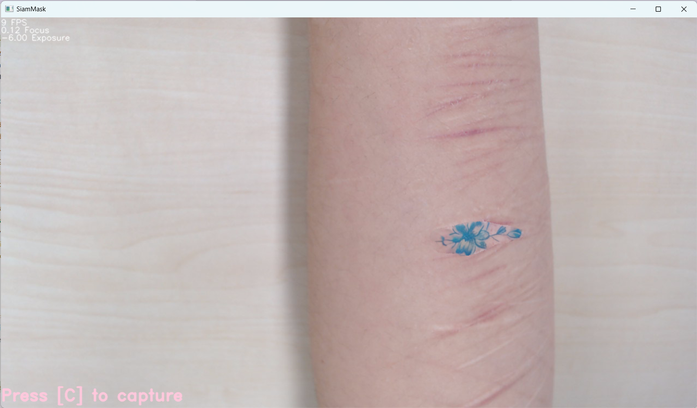

# 생채기 - ArtistRay

사용자로부터 흉터 위치를 입력받아 주변과 어울리는 흉터를 생성해주고, 움직였을 때 트래킹까지 되는 프로그램입니다.

SiamMask를 이용해 Tracking & Segmentation을 진행하며, Blended Latent Diffusion을 활용해 Stable Diffusion 기반 타투를 생성합니다. 인식된 흉터의 rotated bbox를 따라 생성된 타투를 perspective transform하여 타투 이미지를 붙입니다.

## Hardware Preparation
**연결된 웹캠과 웹캠 거치대, 단색 배경(A3용지, 데스크매트 등)이 필요합니다.**<br>
권장사양: i5 10세대 이상 및 RTX 2060 이상

예시 Setup:


## Installation

1. Repo 다운로드
    ```bash
    git clone --recurse-submodules https://github.com/AI-silmu-project/Kizuato_Collection.git
    ```
2. SiamMask 파라미터 다운로드
    ```bash
    cd config
    wget http://www.robots.ox.ac.uk/~qwang/SiamMask_DAVIS.pth
    cd ..
    ```
    또는, [링크](http://www.robots.ox.ac.uk/~qwang/SiamMask_DAVIS.pth)에서 다운로드 후 config 폴더에 넣어주세요.

3. 의존성 설치
    ```
    pip install -r requirements.txt
    ```
    만약 실행 시 더 필요한 패키지가 있다면, 수동으로 설치해 주세요. **PyTorch는 CUDA로 설치하는 것을 강력히 권장합니다.**
    
4. pysot, pyvotkit 빌드 
    **윈도우의 경우, VS C++ Build Tools가 필요합니다!**
    ```bash
    cd SiamMask/utils/pyvotkit
    python setup.py build_ext --inplace
    cd ../../../

    cd SiamMask/utils/pysot/utils/
    python setup.py build_ext --inplace
    cd ../../../../
    ```

## Run
```bash
python main.py [CameraIndex]
```
카메라 인덱스는 기본 0이며, 두 개 이상 있는 경우 수동으로 지정해주세요.

### 조작법
|키|행동|
|---|---|
|`q`| 프로그램 종료|
|`w`| 초점거리 멀리|
|`s`| 초점거리 가까이|
|`a`| 어둡게|
|`d`| 밝게|
|`c`| 캡쳐/캡쳐 취소|
|`x`| 타투 불투명도 증가|
|`z`| 타투 불투명도 감소|

### 사용 Flow

1. `w,a,s,d`를 이용해 흉터가 잘 보이도록 조절한 후, `c`를 눌러 캡쳐해 주세요. 캡쳐가 마음에 들지 않으면 `c`를 다시 눌러 돌아갈 수 있습니다.
2. 캡쳐한 화면에서 흉터를 드래그하여 선택해 주세요. 선택이 끝나면 스페이스바나 엔터를 눌러주세요.
3. 터미널 창에 프롬프트를 입력 후, 엔터를 눌러주세요.
4. 조금 기다리면 흉터를 덮는 타투가 완성되며, 화면에서 타투 결과를 미리 볼 수 있습니다. 불투명도는 `z, x`로 조절해 주세요. 결과는 모두 `outputs` 폴더에 저장되며, 원할 경우 `outputs/output_roi.png`를 편집하여 타투 스티커로 활용할 수 있습니다.
5. `r`을 눌러 타투를 재생성하거나, `c`를 눌러 캡쳐 후 다시 영역을 지정할 수 있습니다.

## Example
다음 흉터를 입력했을 때,
<div style="text-align:center"></div>

'tatoo styled blue flower' 을 프롬프트로 입력하면 다음과 같이 합성됩니다.
<div style="text-align:center"></div>

이를 크롭하면 다음과 같은 타투를 뽑아낼 수 있으며, 이를 편집하여 실제 타투로 프린트할 수 있습니다.
<div style="text-align:center"></div>

모든 이미지는 `outputs` 폴더에 저장됩니다. 새로 이미지를 생성했을 때 기존에 생성한 이미지는 삭제되므로, 주의해주세요.

다음과 같이 트래킹이 가능합니다. 
<div style="display:inline; text-align:center">  </div>